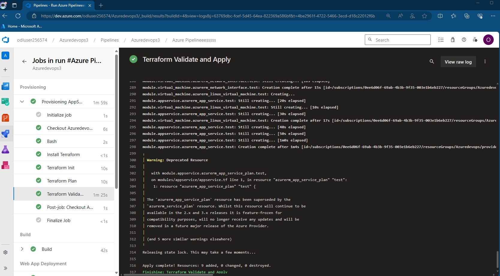
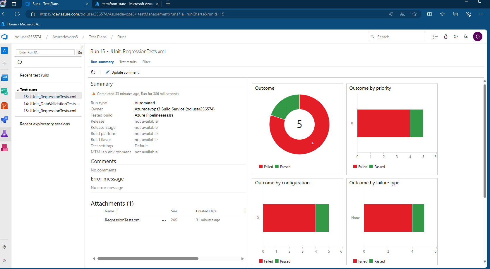

# Overview

Udacity final project Ensuring Quality Releases.

# Project Structure 

- **azure-pipelines.yaml**: azure pipelines yaml
- **automatedtesting**: suites of different tests
  - **jmeter**: load test (JMeterPlan.jmx), CSV inputs, and TestReports (endurance-report, stress-report)
  - **postman**: functional tests postman collections and environments
  - **selenium**: ui tests (uitests.py)
- **fakerestapi**: api files to deplopy webapp
- **screenshoots**: all screen shots requests
- **terraform**: terraform scripts

---

# Screenshoots Log

## Environment Creation & Deployment

- Terraform to apply Infrastructure as Code (IaC)
  - screenshot of the log output of Terraform when executed by the CI/CD pipeline
   
   

- Automated testing tasks
  - screenshot of the successful execution of the pipeline build results page (/_build/results?buildId={id}&view=results)
    

## Webapp Depdeloyment

- Deploy Azure Webapp http://was-eqr.azurewebsites.net/
  

## Automated Testing

- Load test suite 
  - screenshot of the log output of JMeter when executed by the CI/CD pipeline
    
    
  
- Functional test suites 
  - screenshot of the execution of the test suite by the CI/CD pipeline
   

- API-integration tests
  - screenshot of the Run Summary page (which contains 4 graphs)
    
    
  - screenshot of the Test Results page (which contains the test case titles from each test) 
    
  - screenshot of the output of the Publish Test Results step
    

## Monitoring & Observability

- Configure Azure Monitor
  - screenshots of the email received when the alert is triggered
    
  - screenshots of the graphs of the resource that the alert was triggered
    
    
  - screenshots of the alert rule
    

- Azure Log Analytics
  - screenshots of log analytics queries and result sets which will show specific output of the Azure resource
    